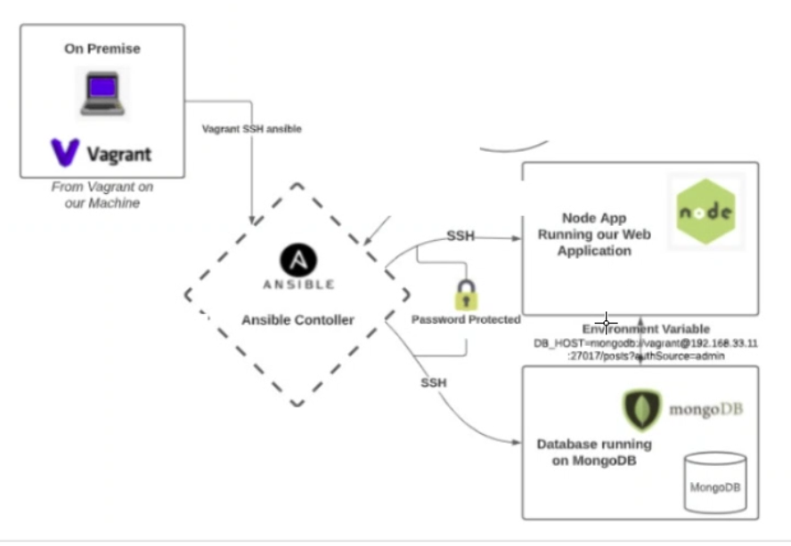
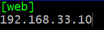

# Infrastrcuture as code (IaC)

## What is IaC?
Infrastructure as Code is the provisioning of infrastructure through code instead of through manual processes. You are able to create configuration files with infrastructure specification.

## What are the benefits?
* Consistent configurations
* Reduced risk - developing and deploying code multiple times can increase the risk of human error
* Faster deployment - use a single command only
* Cost saving
* Repeatable

## Use cases
* Provisioning
* Testing
* Security

## Who uses it?
Companies such as Amaozn and NEtflix use IaC to manage complex and to reduce the time that is put into develping and deploying code over and over again.

## What is configuration management?
It is the process of maintaining computer systems, servers and software in a consistent state. It is a way to ensure that a system runs as expected to as changes are made over time.

## What is Ansible?
Ansible is a powerful open-source automation software application which is written in Python. Is configures systems, deploys software and supports system updates. It can control as many nodes as needed (virtual machines).

## Benefits of Ansible
* Easy to learn
* Uses Python
* Playbooks are written in YAML
* No agent installations are required to manage nodes

## Ansible dependancies
* Python 2.7 - 3.6
* Ubuntu 18.04

## Ansible use cases
* Provisioning
* Configuration management
* Application deployment
* Continuous delivery

## What is YAML? (Yet Another Markup Language)
YAML is a programming language that is designed to be easily readable and it is often used to write configuration files.

## What are Playbooks?
It is a file that contains the ordered tasks that should be executed on a remote server to complete a task. It is essentially a to-do list for Ansible.

## Creating Ansible controller and Web and DB nodes
1. First we needed to open VS and make a new project
2. Open up a git bash terminal and use ```vagrant init``` to open up a vagrant file
3. Replace the code that is in there with the following code
```
# ansible-tech201


# -*- mode: ruby -*-
 # vi: set ft=ruby :
 
 # All Vagrant configuration is done below. The "2" in Vagrant.configure
 # configures the configuration version (we support older styles for
 # backwards compatibility). Please don't change it unless you know what
 
 # MULTI SERVER/VMs environment 
 #
 Vagrant.configure("2") do |config|
  # creating are Ansible controller
    config.vm.define "controller" do |controller|
      
     controller.vm.box = "bento/ubuntu-18.04"
     
     controller.vm.hostname = 'controller'
     
     controller.vm.network :private_network, ip: "192.168.33.12"
     
     # config.hostsupdater.aliases = ["development.controller"] 
     
    end 
  # creating first VM called web  
    config.vm.define "web" do |web|
      
      web.vm.box = "bento/ubuntu-18.04"
     # downloading ubuntu 18.04 image
  
      web.vm.hostname = 'web'
      # assigning host name to the VM
      
      web.vm.network :private_network, ip: "192.168.33.10"
      #   assigning private IP
      
      #config.hostsupdater.aliases = ["development.web"]
      # creating a link called development.web so we can access web page with this link instread of an IP   
          
    end
    
  # creating second VM called db
    config.vm.define "db" do |db|
      
      db.vm.box = "bento/ubuntu-18.04"
      
      db.vm.hostname = 'db'
      
      db.vm.network :private_network, ip: "192.168.33.11"
      
      #config.hostsupdater.aliases = ["development.db"]     
    end
  
  
  end
  ```
4. Then use vagrant up in your terminal and it will begin to launch three different virtual machines. Controller, web and DB
5. We need to open up three different Git Bash terminals and cd into the folder that you amde your prject in
6. Then SSH into each virtual machine using vagrant ssh and then the name of the VM. For example ```vagrant ssh controller```
7. In each terminal we want to run ```sudo apt update -y``` and ```sudo apt upgrade -y```
8. Once your controller VM is running we need to make sure that it has the correct version of Python by using ```python --version```
9. Anything between 2.7 to 3.6 is good and if it is below 2.7 you will need to install a later version
10. Now we need to install ansible using the following
```
sudo apt install software-properties-common
sudo apt-add-repository ppa:ansible/ansible
sudo apt update -y
sudo apt install ansible -y
```
11. Then use ```ansible --version``` to check you have the correct version
12. we can then use ssh vagrant@'IP of VM' to take control of that VM through the controller VM. Answer yes when prompted and then if it asks for a password enter ```vagrant```. The password is invisible

## Using agent nodes with Ansible



* We need to use vagrant up in VS and ssh into each VM using individual terminals
* Then update and upgrade each one
* In controller VM use ```cd /etc/ansible/``` to go to that directory
* Use ls to view the files inside, you should see ```ansible.conf``` and ```hosts```
* Use sudo apt install tree to install that package
* Use ```sudo ansible all -m ping``` to request a response from a node
* ```all``` checks all agent nodes, ```-m``` is the module and ```ping``` pings the nodes to check for a connection
* If there are any there it will come back as green, if not an error will return
* In this case an error has returned as we have not provided any information to the nodes
* Use ```ssh vagrant@192.168.33.10``` in the controller VM to control the web VM - the password is vagrant
* Run update and upgrade
* Now use ```exit``` to go back to controller
* Now to control the db VM use ```ssh vagrant@192.168.33.11``` - the passord is vagrant
* Run update and upgrade
* Now use ```exit``` to go back to controller
* Make sure you are still in the file ```/etc/ansible/```
  

## To provide information to the agent node
* Run ```sudo nano hosts``` to bring up the host file and scroll to the bottom
* Create a group by using ```[web]``` and underneath put ```192.168.33.10```
* It should look like this



* Save and exit
* Use ```sudo ansible web -m ping``` to ping the agent node
* You should then see an error with a public key permission denied
* To provide the password do ```sudo nano hosts``` and type this next to the IP ```ansible_connection=ssh ansible_ssh_user=vagrant ansible_ssh_pass=vagrant```
* It should look like this


* The first part is telling ansible to use ssh for the connection, the second part is stating the user and the third part provides the password
* Save and exit and then use ```sudo ansible web -m ping``` again
* You may be asked to say yes or provide the password again - password is vagrant
* You should now get a success message
* Now we want to do the same for the db VM
* Run ```sudo nano hosts``` and scroll to the bottom
* This time put ```[db]``` and underneath put ```192.168.33.11```
* Then next to the IP put ```ansible_connection=ssh ansible_ssh_user=vagrant ansible_ssh_pass=vagrant```
* Save and exit
* Use ```cd /etc/ansible/``` and run ```sudo nano ansible.cfg```
* Add ```host_key_checking = false``` undeer the defaults section and save and exit
* Now run ```sudo ansible all -m ping``` and you should get two success messages come back this time

## Adhoc commands
* Use ```sudo ansible web -a "date"``` to search the internet to find out the current date and time of the region that the web VM is using
* We can use ```sudo ansible all -a "date"``` to see the time zone for all the VM's we are using
* To find out the operating systems of the VM's use ```sudo ansible all -a "uname"```
* To see the free memory available on each VM use ```sudo ansible all -a "free"```
* To check what information is currently there use ```sudo ansible all -a "ls"```
  

## Task - copying over a file from controller to web VM
Use ```sudo nano testing.txt``` and write in ```# testing data transfer from controller to web vm using adhoc command```
1. Use the code ```sudo ansible web -m copy -a "src=/etc/ansible/testing.txt dest=/home/vagrant"```

## Codifying using playbooks
* Follow all the steps above first
* In the controller vm cd into ```/etc/ansible```
* To install nginx create a file using ```sudo nano install-nginx-playbook.yml```
* Write a comment to say ```# creating a playbook to install nginx in webserver```
* A YAML file always starts with ---
* Next write out the following. Each line under the comments have to be two spaces from the start and not tabbed
```
---

# where would you like to install nginx
- hosts: web
# would you like to see logs
  gather_facts: yes
# do we need admin access - sudo
  become: true
# add the instructions - commands
  tasks:
  - name: Install nginx in web-server

    apt: pkg=nginx state=present 
# ensure status is running/active
```
* Save and exit
* Use cat install-nginx-playbook.yml to check it has saved
* To run the playbook use ```sudo ansible-playbook install-nginx-playbook.yml```
* To check nginx has installed use ```sudo ansible web -a "systemctl status nginx"```
* We could also enter this IP into a browser ```192.168.33.10```

## How to make a playbook repeatable
* Go back into the file ```install-nginx-playbook.yml``` and change hosts to all
* This is how it should look
```
# where would you like to install nginx
- hosts: all
```

## Creating a playbook to install nodejs
* Follow all the previous steps to set up controller, web and db VM's
* In the controller VM cd into ```/etc/ansible```
* Create a file using ```sudo nano install-nodejs-playbook.yml```
* Add the following into the file
```
# creating a playbook to install nodejs
# YAML file starts with ---
---
# where would you like to install nodejs?

- hosts: web

# would you like to see the logs?

  gather_facts: yes

# do we need admin access? - "become: true" adds sudo to each command we use

  become: true

# add the instructions - commands. "pkg" = package, "state=present" tells us the status        
  tasks:
  - name: Install python
    apt: pkg=python state=present

  tasks:
  - name: Install nodejs
    apt: pkg=nodejs state=present

  tasks:
  - name: Install npm

    apt: pkg=npm state=present
# ensure the status of nginx is running/active
```
* We can check thatnodejs is working by using ```sudo ansible web -a "nodejs --version"```
* This should bring up the version that has installed
* We then need to copy over the app folder from our local storage to our controller VM
* Use ```scp -r /c/Users/billy/tech221_virtualisation/app vagrant@192.168.33.10:/home/vagrant```
* Password is vagrant
* Run ```ssh vagrant@192.168.33.10``` to control the web Vm from the controller VM
* Use ```CD app ```and then start the app using ```node app.js```
* Then put ```192.168.33.10:3000``` in a browser and the Sparta app should load

## Installing MongoDb using playbooks
1. Follow all of the previous steps to set up the controller, web and db VM's
2. CD into /etc/ansible location
3. Create a file by using ```sudo nano mongo-db-playbook.yml```
4. Add the following into it
```
---
# setting up Mongodb in DB-agent-node

- hosts: db
  gather_facts: yes

  become: true

# adding the instructions to install mongodb and status running

  tasks:
  - name: configuring Mongo-db in db agent node
    apt: pkg=mongodb state=present
```
5. Save and exit
6. Now run ```sudo ansible-playbook mongo-db-playbook.yml```
7. After this run ```sudo ansible db -a "systemctl status mongodb"```
8. You should now see that MongoDB is running

## Connecting Sparta app to DB
1. In the controller VM use ```ssh vagrant@192.168.33.11``` to take control of the db VM
2. Then open the mongo config file using sudo nano ```/etc/mongod.conf``` and change the bind_ip to ```0.0.0.0```
3. Restart and enable mongodb using ```sudo systemctl restart mongodb ```and then ```sudo systemctl enable mongodb```. This implements the changes we just made
4. Now exit out of the db VM and go into your web VM using ```ssh vagrant@192.168.33.10```
5. We need to create an environment variable using ```export DB_HOST=mongodb://192.168.33.10:27017/posts```
6. Then cd into the app folder
7. Run ```npm install``` and then ```node app.js```
8. Use the IP ```192.168.33.10:3000/posts``` in a browser to view the posts page on the Sparta app

## Creating a playbook to configure mongodb config file
1. Make sure you are in the location /etc/ansible in the controller VM and then create a file using ```sudo nano mongo-conf.yml```
2. Then add the following into the file
```
---

- hosts: db

  gather_facts: yes

  become: true

  tasks:
  - name: change bing_ip in mongodb.conf
    lineinfile:
      path: /etc/mongodb.conf
      regexp: 'bind_ip = 0.0.0.10'
      line: 'bind_ip = 0.0.0.0'
      backrefs: yes

  - name: restart mongodb
    shell: systemctl restart mongodb

  - name: enable mongodb
    shell: systemctl enable mongodb
```
3. Save and exit
4. Run ```sudo ansible-playbook mongo-conf.yml``` to implement the playbook
5. We can use ```sudo ansible db -a "systemctl status mongodb"``` to check if mongodb is running

## Creating a playbook to add an environment variable
1. Make sure you are in the location /etc/ansible in the controller VM and then create a file using ```sudo nano app-env.yml```
2. Add the following into it
```
---

- hosts: web

  gather_facts: yes

  become: true

  tasks:
  - name: create DB_HOST
    shell: export DB_HOST=mongodb://192.168.33.11:27017/posts
```
3. Use ```sudo ansible-playbook app-env.yml``` to implement the playbook
4. Take control of the web VM using ```ssh vagrant@192.168.33.10```
5. CD into app
6. Run ```npm install``` and ```node app.js```
7. Use the IP ```192.168.33.10:3000/posts``` in a browser to view the posts page on the Sparta app